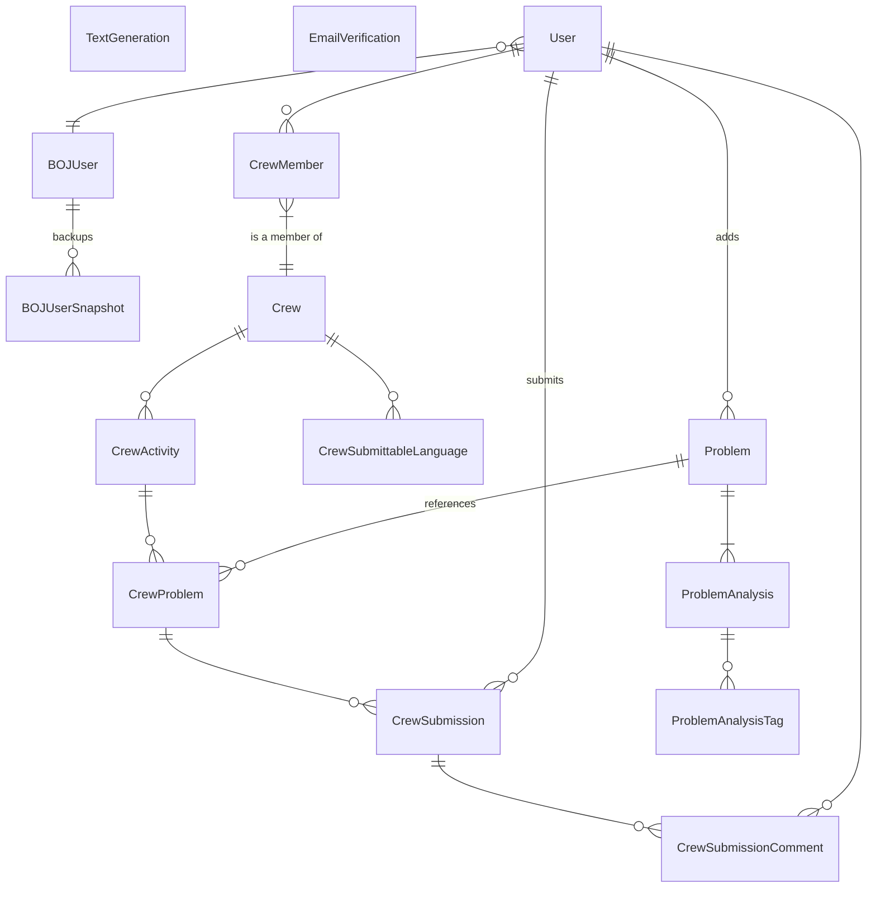

## 서비스 구조

| 서비스 명         | 설명                                                                                                                                                                                                                                                                                                                                                                                                                                                                          |
| ----------------- | ----------------------------------------------------------------------------------------------------------------------------------------------------------------------------------------------------------------------------------------------------------------------------------------------------------------------------------------------------------------------------------------------------------------------------------------------------------------------------- |
| `users`           | <ul><li>서비스 전역적으로 공유되는 사용자 모델을 이 곳에서 정의하고 관리한다.</li><li>사용자 인증 및 회원가입 기능을 제공한다.</li></ul>                                                                                                                                                                                                                                                                                                                                      |
| `problems`        | <ul><li>사용자가 문제를 등록하거나 관리할 수 있다.</li><li>새로운 문제를 등록하거나 수정할 시, 해당 문제는 백그라운드에서 자동으로 LLM에 의해 분석된다. </li></ul>                                                                                                                                                                                                                                                                                                            |
| `crews`           | <ul><li>크루(스터디 그룹)를 만들고 관리하는 서비스.</li><li>크루 멤버를 관리하거나, 멤버가 아닌 경우 새로운 크루에 지원을 할 수 있다.</li><li>캡틴(스터디 그룹장)은 새로운 회차를 등록하고, 각 회차 별로 크루들이 풀어야 할 문제를 등록할 수 있다. (문제는 `problems` 서비스에서 등록한 것을 사용한다.)</li><li>멤버들은 크루 활동 회차들에 등록된 문제에 대한 풀이를 제출할 수 있다.</li><li>다른 멤버가 제출한 풀이에 코드리뷰(코드 라인 별 댓글)을 남길 수 있다.</li></ul> |
| `boj`             | <ul><li>사용자의 백준아이디를 바탕으로, 해당 사용자의 백준 티어 정보를 받아오며 기록하는 서비스.</li></ul>                                                                                                                                                                                                                                                                                                                                                                    |
| `llms`            | <ul><li>Gemini, ChatGPT 등 API가 공개된 기반모델들을 바탕으로 다른 서비스들에서 요청한 text generation 작업을 수행하는 서비스.</li><li>LLMs의 느린 응답속도로 발생하는 busy waiting을 방지하기 위해, text generation 요청들은 백그라운드에서 비동기적으로 처리된다.</li></ul>                                                                                                                                                                                                 |
| `background_task` | <ul><li>백그라운드에서 비동기적으로 처리하기 위한 작업들을 관리하는 서비스.</li><li>[Django Background Tasks](https://django-background-tasks.readthedocs.io/en/latest/) 앱을 이식하고 개조하였다. 개조를 통해 API 서버의 구동 시, 자동으로 비동기 작업 큐가 구동되도록 되어있다<br>(설정의 `BACKGROUND_TASK_AUTO_RUN` 항목을 `True`로 설정하면 서버 구동 시, 비동기 큐도 같이 구동된다.)</li></ul>                                                                           |

## 디렉터리 구조

### 프로젝트 디렉터리 구조

본 프로젝트는 Django 프레임워크를 기반으로 작성되었으며,
아래와 같은 디렉터리 구조를 가지고 있습니다.

```text
app
├── config/                 # 전역적인 Django 서버 설정 및 secret 등을 관리
├── common/                 # 특정 앱에 종속되지 않고, 공통적으로 사용되는 모듈
├── fixtures/               # 테스트를 위한 데이터베이스 fixture 모음
├── apps/                   # 각 앱이 보관되는 디렉토리
│   ├── background_task/
│   ├── boj/
│   ├── crews/
│   ├── llms/
│   ├── problems/
│   └── __init__.py
├── users/                  # 서비스 전반적으로 공통으로 사용되는 사용자 로그인, 인증과 관련된 앱
└── manage.py               # Django 프로젝트의 개발 시 entrypoint
```

### 앱 디렉터리 구조

서비스 요구사항을 명확하게 수행할 수 있도록
아래의 디렉터리 구조를 공통적으로 갖도록 설계되었습니다.

```diff
  app
  ├── apps/
  │   ├── <APP_NAME>/
  │   │   ├── __init__.py
  │   │   ├── apps.py             # [Django] 해당 앱에 대한 설정, 시작 시 트리거 될 동작 등을 정의하는 모듈
  │   │   ├── admin.py            # [Django] 해당 앱의 (models.py에서 정의된) ORM들을 등록하고, 관리자 페이지에서 수행가능한 액션 등을 정의하는 모듈
  │   │   │
+ │   │   ├── enums.py            # 해당 앱 도메인과 관련된 열거형 객체들을 정의하는 모듈 (Django의 Choices 포함)
  │   │   │
  │   │   ├── models.py           # [Django] 데이터베이스 ORM을 사용하기 위한 모델 객체들을 정의하는 모듈 (DAO)
+ │   │   ├── dto.py              # 해당 앱의 도메인에 특화된 Data Transfer Object를 정의하는 모듈.
+ │   │   ├── converters.py       # 해당 앱의 도메인에 특화된 DTO를 생성하기 위해 기존의 객체(ORM)등을 변환하기 위한 모듈.
  │   │   │
  │   │   ├── views.py            # [Django] View 객체들을 정의하는 모듈
+ │   │   ├── permissions.py      # views.py의 각 뷰에서 사용자의 작업 권한을 검사하기 위한 객체들을 정의하는 모듈
+ │   │   ├── serializers.py      # views.py의 각 뷰에서 DTO, DAO 등을 입력받아 JSON 형태로 바꾸거나, JSON을 입력받아 모델(DAO)로 매핑 시키는 객체 정의 (Django-REST-framework 사용)
+ │   │   ├── urls.py             # 해당 앱에 관련된 urlpatterns를 정의 (URL endpoint와 view객체 매핑)
  │   │   │
  │   │   ├── tests.py            # [Django] 해당 앱에 관련된 단위 테스트 코드
  │   │   │
  │   │   └── ...                 # 필요에 따라 추가적인 모듈 작성
  │   ...
  │   └── __init__.py
  ...
  └── manage.py
```

Django에서 `startapp` 명령을 이용할 시 자동으로 생성되는, Django에서 관리하는 모듈이 아닌 것들을 (`diff +`로) 하이라이트 하였습니다.

## 데이터베이스 구조

[TLE]의 기능 요구사항을 충족하기 위해, 아래와 같은 데이터베이스 구조를 채택하고 있습니다.



[TLE]: https://tle-kr.com
[MSA]: https://cloud.google.com/learn/what-is-microservices-architecture
