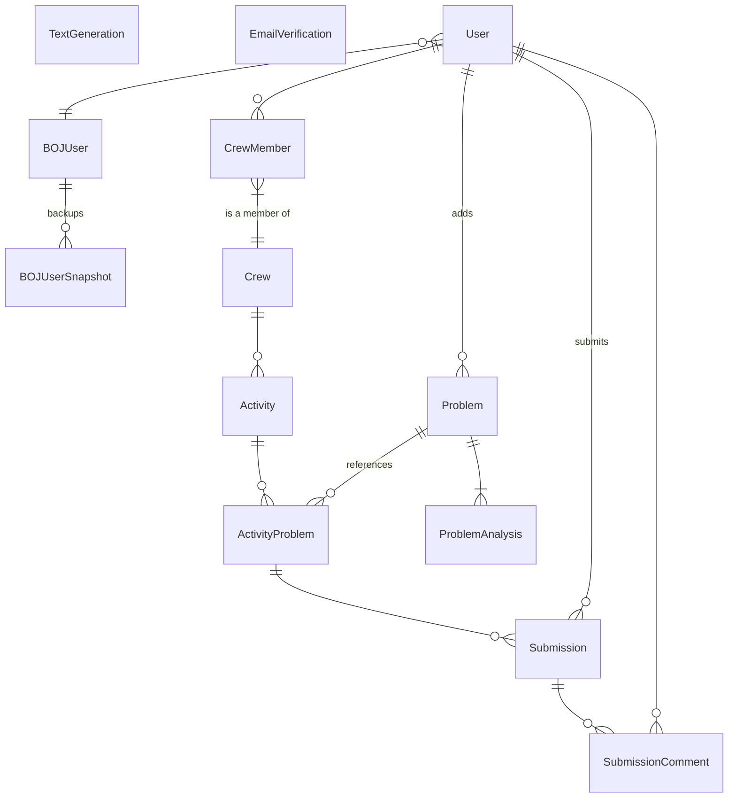

## 데이터베이스 구조

[TLE]의 기능 요구사항을 충족하기 위해, 아래와 같은 데이터베이스 구조를 채택하고 있습니다.

```mermaid
erDiagram

TextGeneration
EmailVerification

User }o--|| BOJUser : ""
User ||--o{ Problem : "adds"
User ||--o{ CrewMember : ""
User ||--o{ Submission : "submits"
User ||--o{ SubmissionComment : ""

BOJUser ||--o{ BOJUserSnapshot : "backups"
Problem ||--o{ ActivityProblem : "references"
Problem ||--|{ ProblemAnalysis : ""

CrewMember }|--|| Crew : "is a member of"
Crew ||--o{ Activity : ""
Activity ||--o{ ActivityProblem : ""
ActivityProblem ||--o{ Submission : ""
Submission ||--o{ SubmissionComment : ""
```
[TLE]: https://tle-kr.com
